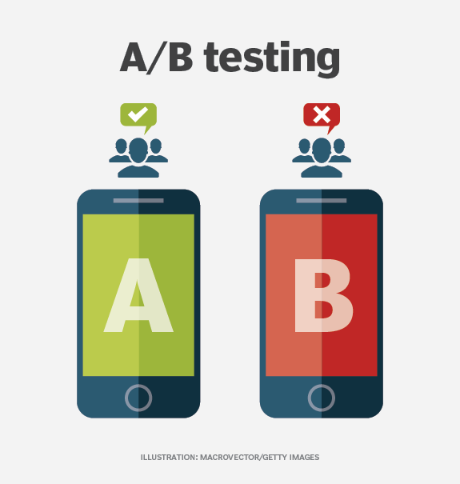

# A/B Testing: Improving User Retention

## 📌 Introduction
- Cookies Cats is a online gaming company. It is planning to launch a new gate to improve user experience and the compay wants to test whether the new gate perform better in customer retention than the old one.
- Motivation: Use data available, compare customer retention rate between old and new platform.

## Data Overview:
- Dependent variable: retention in 1 and 7 days
- Independent variables: userid, control/ treatment indicator

## Technology Used

<ul>
  <li>A/B Testing</li>
  <li>Bootstraping</li>

</ul>

## Contents

<h3>1. Guardian Checks</h3>
<h3>2. Proportion Z test</h3>
<h3>3. Bootsraping</h3>

## Conclusion

- Treatment group performs better in customer retention

## Projects Completed

1. <a href="https://github.com/lyphuong601/job-postings-data-cleaning">Job Posting Data Cleaning</a>
2. <a href="https://github.com/lyphuong601/data-science/tree/main/linear-regression-BGD-deployment">House Price Predictions</a>
3. <a href="https://github.com/lyphuong601/adventuework-inc-da-project"> Adventuework Inc DA Project</a>

More projects coming up soon. Do drop a ⭐ if you like it.