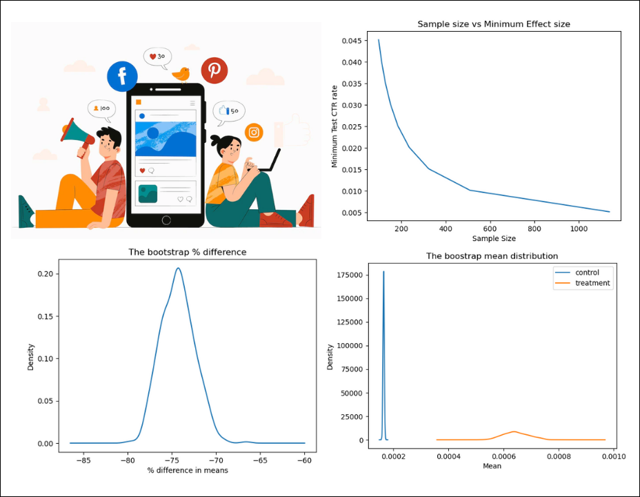

# A/B Testing: Social Media Ads Conversion

## 📌 Introduction
- Motivation: Use data available, compare click through rate (CTR) and cost per click (CPC) for control and treatment group

## Data Overview:
- Dependent variable: clicks, impressiion, spent, ads campaign id
- Independent variables: control/ treatment indicator

## Technology Used

<ul>
  <li>A/B Testing</li>
  <li>Bootstraping</li>

</ul>

## Contents

<h3>1. Guardian Checks</h3>
<h3>2. Proportion Z test</h3>
<h3>3. Hypothesis testing</h3>
<h3>4. Bootsraping</h3>

## Conclusion

- Treatment group performs better in click through rate and cost per click metrics.

## Projects Completed

1. <a href="https://github.com/lyphuong601/job-postings-data-cleaning">Job Posting Data Cleaning</a>
2. <a href="https://github.com/lyphuong601/data-science/tree/main/Telco-customer-churn">Customer Churn Prediction</a>
3. <a href="https://github.com/lyphuong601/rfm-customer-segmentation"> Customer Segmentation: a K-Means Approach</a>

More projects coming up soon. Do drop a ⭐ if you like it.